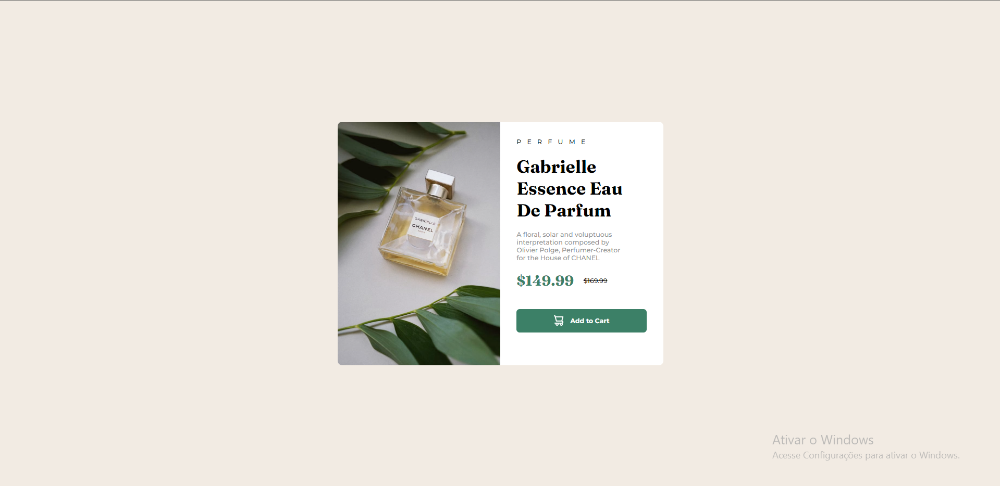

# Product preview card component

Este é um site desenvolvido apartir do desafio Front-end Mentor

https://www.frontendmentor.io/challenges/product-preview-card-component-GO7UmttRfa

Este projeto foi feito para estudo próprio, com apredizagem das propriedades em CSS: FLEXBOX e GRID.

## Imagens do projeto

Desktop:

Mobile:

## Desafio que tive neste projeto:

O design do site no dekstop, foi um pouco fácil, conseguindo fazer mais rápido do que outros projetos. Já a parte do responsivo, no começo foi até um pouco fácil, porém o desafio foi na parte da imagem, pois não assumia o tamanho do seu espaço, mas no fim deu certo. No fim o design asemelha ao que foi pedido.

## Tecnologias usadas:
- Html
- CSS

## Redes socias:
- <a href="https://github.com/JhonpsDias" target="_blank">Git Hub</a>
- <a href="https://www.linkedin.com/in/jo%C3%A3o-pedro-dias-castro-a795a0295/" target="_blank">Linkedin</a>

Projeto feito por - <i>João Pedro Dias Castro</i>